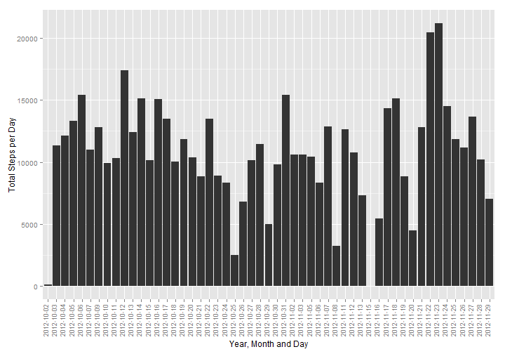
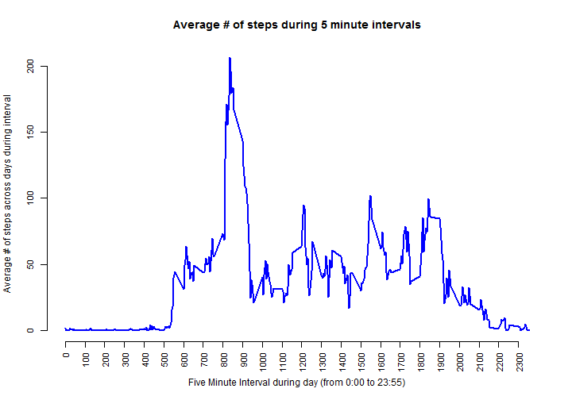
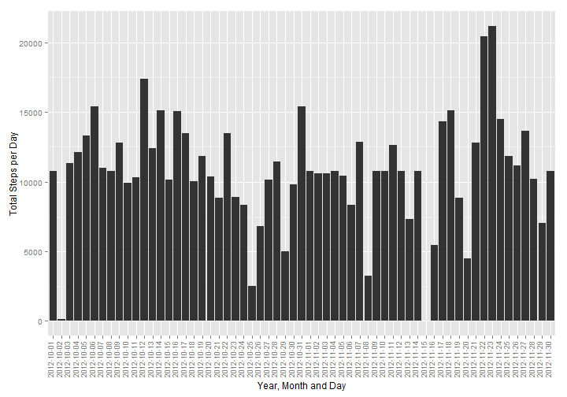
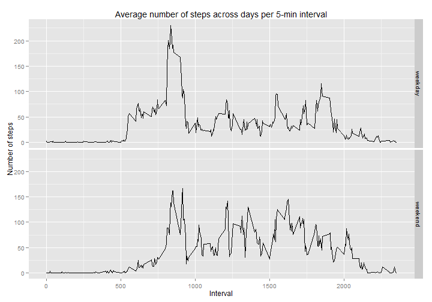

Reproducible Research
=============================================
## Peer Assessment 1 
by Andrea Taglioni, issued on Tuesday, October 07, 2014  
 
 
This Markdown documents the analysis performed on data (number of steps taken in 5 minute intervals each day) coming from 
https://d396qusza40orc.cloudfront.net/repdata%2Fdata%2Factivity.zip
deriving from a personal activity monitoring device, collecting data at 5 minute intervals through out the day; two months of data from an anonymous individual collected during October and November, 2012.
 
### Step 1: Loading and preprocessing the data 
Let's start with some code to check whether data file exists, or download and unpack it, and some more code to transform data...


```r
library("knitr")
opts_chunk$set(echo=TRUE)
```


```r
#Populating paths
mydatafile1 <- "activity.csv"
mydatafile2 <- "activity.zip"
mydatafile3 <- "repdata-data-activity.zip"

#Checking in which path file exists, or unzipping it
if(file.exists(mydatafile1)) {
        OKPath <- mydatafile1
} else if(file.exists(mydatafile2)) {
        unzip(mydatafile2)
        OKPath <- mydatafile1
} else if(file.exists(mydatafile3)) {
        unzip(mydatafile3)
        OKPath <- mydatafile1
} else {
        message("!!! File can not be found zipped or unzipped. Can't progress further... please ignore rest of the code/analysis below, and try to repeat after file has been dowloaded.")
                OKPath <- ""
}

#Reading file in OKPath
if(OKPath != "") { 
                MyData <- read.csv(OKPath, na.strings = "NA") 
        } else { 
                # in case input file is not present, I set up a dummy
                # data.frame not to let rest of the code crash
                MyData = data.frame(steps=1, date="2012-10-01", interval=0) 
        }
```

Here follows the data structure:


```r
str(MyData)
```

```
## 'data.frame':	17568 obs. of  3 variables:
##  $ steps   : int  NA NA NA NA NA NA NA NA NA NA ...
##  $ date    : Factor w/ 61 levels "2012-10-01","2012-10-02",..: 1 1 1 1 1 1 1 1 1 1 ...
##  $ interval: int  0 5 10 15 20 25 30 35 40 45 ...
```

The dataset contains the variables:

* **steps**: Number of steps taking in a 5-minute interval (missing values as NA)
* **date**: The date on which the measurement was taken in YYYY-MM-DD format
* **interval**: Identifier for the 5-minute interval in which measurement was taken

Now creating a dataframe without NA values to get clean means...


```r
MyCleanData <- MyData[!is.na(MyData$steps),]
str(MyCleanData)
```

```
## 'data.frame':	15264 obs. of  3 variables:
##  $ steps   : int  0 0 0 0 0 0 0 0 0 0 ...
##  $ date    : Factor w/ 61 levels "2012-10-01","2012-10-02",..: 2 2 2 2 2 2 2 2 2 2 ...
##  $ interval: int  0 5 10 15 20 25 30 35 40 45 ...
```

### Step 2: What is mean total number of steps taken per day?

First let's see how total number of steps are distributed per each day along the period:


```r
StepsPerDay <- aggregate(MyCleanData$steps, by=list(date = MyCleanData$date), FUN=sum)

library("ggplot2")
qplot(StepsPerDay$date, data = StepsPerDay, weight=StepsPerDay$x, ylab="Total Steps per Day", xlab="Year, Month and Day") + theme(axis.text.x = element_text(angle=90, hjust=1, vjust=0, size=9))
```

 

Second let's see mean and median of total number of steps per day along the period: 

-MEAN-

```r
mean(StepsPerDay$x)
```

```
## [1] 10766
```
-MEDIAN-

```r
median(StepsPerDay$x)
```

```
## [1] 10765
```

### Step 3: What is the average daily activity pattern?

Let's make a time series plot of the 5-minute interval (x-axis) and the average number of steps taken, averaged across all days (y-axis)


```r
StepsPerInterval <- aggregate(MyCleanData$steps, by=list(interval = MyCleanData$interval), FUN=mean)
        
plot(StepsPerInterval$interval, StepsPerInterval$x, type="l", xlab= "Five Minute Interval during day (from 0:00 to 23:55)", ylab= "Average # of steps across days during interval", col="blue" , lwd=2, main="Average # of steps during 5 minute intervals", axes=FALSE)
axis(side=1, at=seq(0, 2355, by=100), cex.axis=0.9, las = 2)
axis(side=2, cex.axis=0.9)
```

 

Let's find which 5-minute interval, on average across all the days in the dataset, contains the maximum number of steps:


```r
IntervalWithMaxAvgSteps <- as.character(StepsPerInterval[which.max(StepsPerInterval$x),"interval"])
IntervalWithMaxAvgSteps
```

```
## [1] "835"
```
Time where maximum number of steps occurs (avg across observation days) is 8:35

### Step 4: Imputing missing values

Let us calculate and report the total number of missing values in the dataset (i.e. the total number of rows with NAs):


```r
# in the sum of logical values TRUE is valued as 1, FALSE as 0
NumberofNArows <- sum(is.na(MyData$steps))
NumberofNArows
```

```
## [1] 2304
```

Create new Dataset filling NAs.
I decided to use the strategy to fill the NAs with average values across days for the same time interval.


```r
MyFilledData <- merge(MyData, StepsPerInterval, all.x=TRUE)
MyFilledData[is.na(MyFilledData$steps),"steps"] <- MyFilledData[is.na(MyFilledData$steps),"x"] 
MyFilledData$x <- NULL
str(MyFilledData)
```

```
## 'data.frame':	17568 obs. of  3 variables:
##  $ interval: int  0 0 0 0 0 0 0 0 0 0 ...
##  $ steps   : num  1.72 0 0 0 0 ...
##  $ date    : Factor w/ 61 levels "2012-10-01","2012-10-02",..: 1 54 28 37 55 46 20 47 38 56 ...
```

Now let's make a histogram of the total number of steps taken each day...


```r
StepsPerDayClean <- aggregate(MyFilledData$steps, by=list(date = MyFilledData$date), FUN=sum)

qplot(StepsPerDayClean$date, data = StepsPerDayClean, weight=StepsPerDayClean$x, ylab="Total Steps per Day", xlab="Year, Month and Day") + theme(axis.text.x = element_text(angle=90, hjust=1, vjust=0, size=9))
```

 

... and Calculate and report the mean and median total number of steps taken per day.

-MEAN-

```r
mean(StepsPerDayClean$x)
```

```
## [1] 10766
```
-MEDIAN-

```r
median(StepsPerDayClean$x)
```

```
## [1] 10766
```

Do these values differ from the estimates from the first part of the assignment? What is the impact of imputing missing data on the estimates of the total daily number of steps?

Based on this exercise, filling the missing values with an average value on the same interval, seems not to affect Mean and Median. (In my case median has a limited difference of decimals which is then rounded to one).

### Step 5: Are there differences in activity patterns between weekdays and weekends?

First let us create a new factor variable in the dataset with two levels - "weekday" and "weekend" indicating whether a given date is a weekday or weekend day.


```r
Sys.setlocale("LC_TIME", "English")
```

```
## [1] "English_United States.1252"
```

```r
MyFilledData$weekpart <- factor(weekdays(as.Date(as.character(MyFilledData$date),"%Y-%m-%d")) %in% c('Sunday','Saturday'))
levels(MyFilledData$weekpart) = c("weekday", "weekend")
head(MyFilledData,7)
```

```
##   interval steps       date weekpart
## 1        0 1.717 2012-10-01  weekday
## 2        0 0.000 2012-11-23  weekday
## 3        0 0.000 2012-10-28  weekend
## 4        0 0.000 2012-11-06  weekday
## 5        0 0.000 2012-11-24  weekend
## 6        0 0.000 2012-11-15  weekday
## 7        0 0.000 2012-10-20  weekend
```

Let us make a panel plot containing a time series plot of the 5-minute interval (x-axis) and the average number of steps taken, averaged across all weekday days or weekend days (y-axis). I decided to use ggplot2 library, since this chouce was left free in the exercise:


```r
StepsPerIntervalAvg <- aggregate(MyFilledData$steps, by=list(weekpart = MyFilledData$weekpart, interval = MyFilledData$interval), FUN = mean)

qplot(interval, x, data = StepsPerIntervalAvg, geom = "line", facets = weekpart ~ ., xlab="Interval", ylab="Number of steps", main="Average number of steps across days per 5-min interval")
```

 

The pattern seems to be different in weekends: looks like the person who was monitored starts moving later during weekends (less steps in early hours), while in central hours of the day moves more during weekends. 

